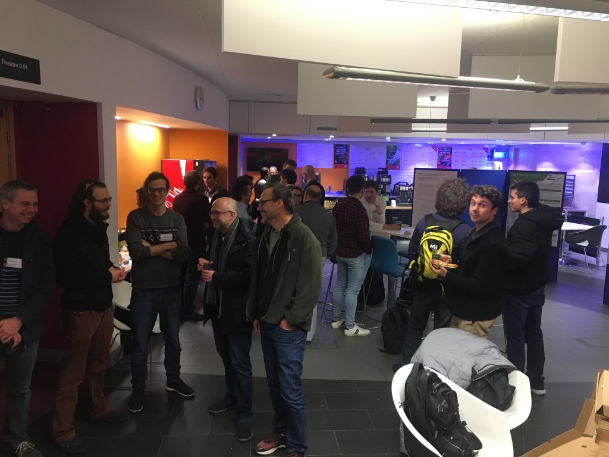
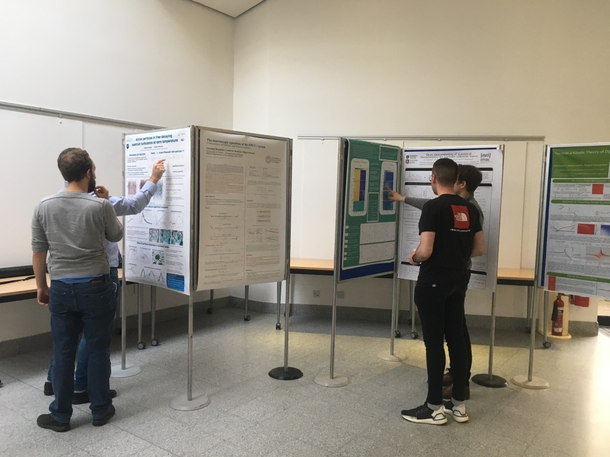
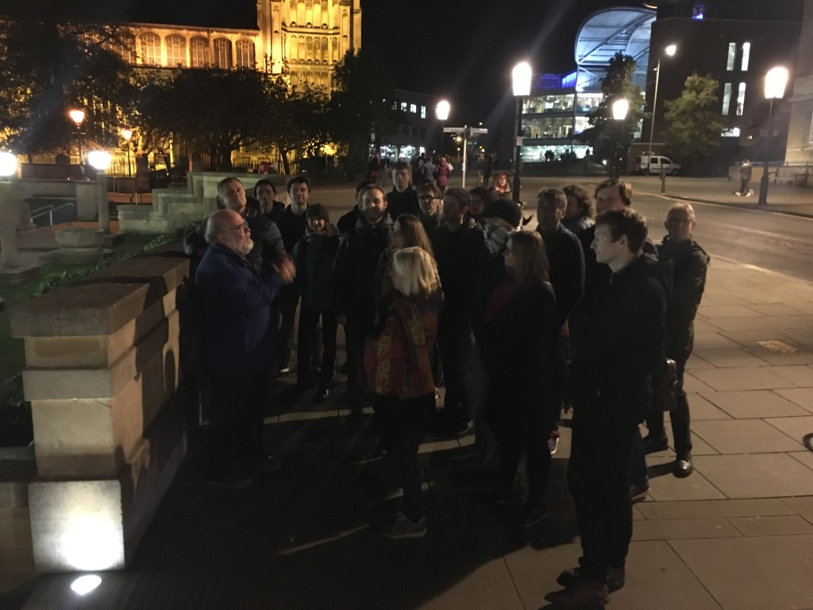
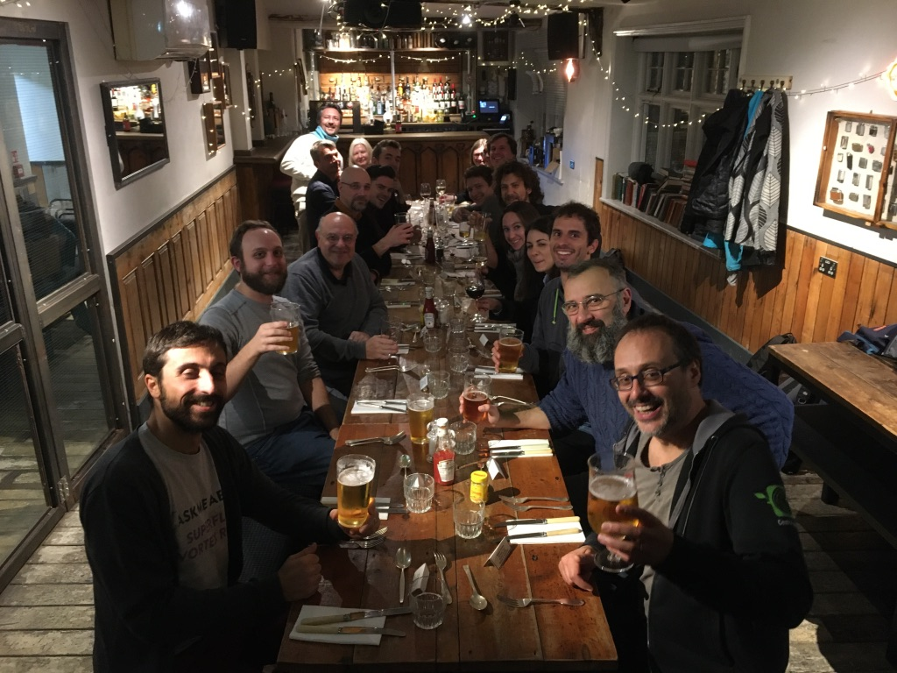
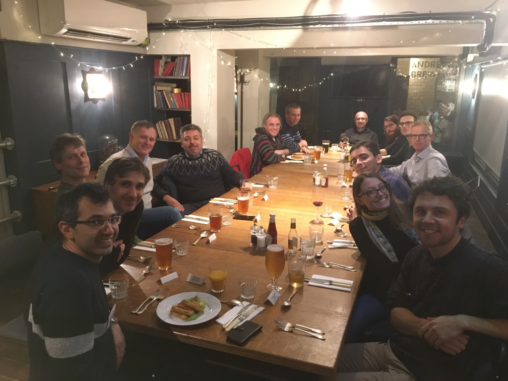

## When and where?
30th October - 1st November 2019

School of Mathematics, University of East Anglia, Norwich (UK)

Download here the [route indications](./routes.pdf), the [UEA campus map](./UEACampusMap.pdf), and the [Norwich Research Parrk map](./NRPMap.pdf). 

## Aim of the workshop
The workshop will bring together physicsts and applied mathematicians researching in the area of waves, coherent structures and turblulence. The even has four sessions corresponding to the following themes:
- Classical vortex dynamics
- Nonlinear waves
- Wave interactions and turbulence
- Coherent structures and topological excitations

Each session will have an introductory lecture on the theme (aimed at the non-experts) and then a handful of more specific talks.
The participation of PhD students, postdocs and early career researchers to the event is particularly encouraged.
Depending on the numbers of participants, a formal poster session might also take place.

## Program
Please find [here](./program.pdf) the current version of the program (updated Oct 23rd 2019).

## List of speakers
- Andrew Baggaley
- Magnus Borgh
- Miguel Bustamante - [slides](slides/Bustamante.pdf)
- Amit Chattopadhyay - [slides](slides/Chattopadhyay.pdf)
- Thibault Congy
- Laura Cope - [slides](slides/Cope.pdf)
- Gennady El - [slides](slides/El.pdf)
- Gavin Esler
- Thomas Gasenzer
- Andrew Gilbert - [slides](slides/Gilbert.pdf)
- Christophe Josserand - [slides](slides/Josserand.pdf)
- Anna Kalogirou - [slides](slides/Kalogirou.pdf)
- Jason Laurie - [slides](slides/Laurie.pdf)
- Sergey Nazarenko - [slides](slides/Nazarenko.pdf)
- Miguel Onorato - [slides](slides/Onorato.pdf)
- Emilan Parau
- Stéphane Randoux
- Renzo Ricca
- Hayder Salman
- Pierre Suret
- Simon Thalabard - [slides](slides/Thalabard.pdf)

## List of posters
- Umberto Giuriato - [poster](posters/Giuriato.pdf)
- Adam Griffin - [poster](posters/Griffin.pdf)
- Giacomo Roberti - [poster](posters/Roberti.pdf)
- Hugo S. Tavares - [poster](posters/Tavares.pdf)

## Pictures of the event

_Welcome party_

_Posters_

_Tour of Norwich city centre_

_Social dinner_

## Fees and financial support
There are no workshop fees. 
Accommodation and meals will be covered for all the participants (up to a limit of 30 partipants in total).

Limited funds are available to cover travel expenses.
If you require financial assistance for your travel, please mention it during your registration.

## Registration
To register to the workshop and express your willingness to present a talk or a poster, please contact [Davide Proment](mailto:d.proment@uea.ac.uk).

## Organisers
- [Davide Proment](http://davideproment.pythonanywhere.com) (University of East Anglia, UK)
- [Jason Laurie](http://www.jasonlaurie.com/) (Aston University, UK)

## Funding agencies
- Wave Turbulence SIG, UK Fluids Network
- EPSRC (project EP/P023770/1, On the interaction between quantum vortices and phonon radiation in Bose-Einstein condensates)
- European Union’s Horizon 2020 (Marie Skłodowska-Curie grant agreement No 823937)

